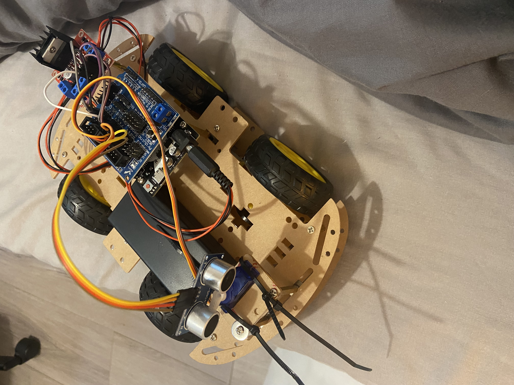
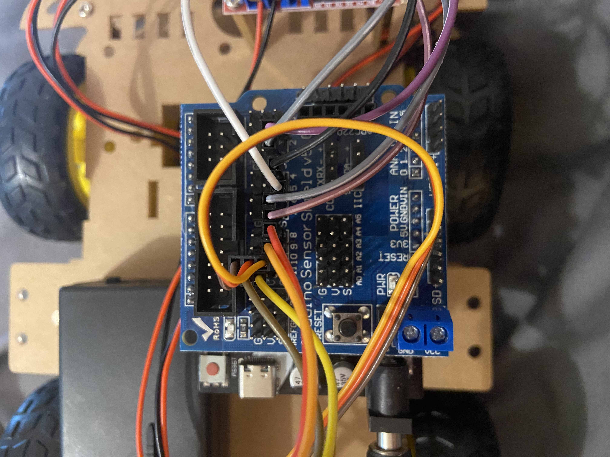

# Arduino-Based Ultrasonic Obstacle Avoidance Rover

## Description
An Arduino-based rover using ultrasonic sensors to detect and avoid obstacles.

## Technologies Used:
- Arduino Uno
- C/C++
- Ultrasonic Sensor (HC-SR04)
- Servo Motor
- Standard motors
- L298N Motor Driver
- Sensor shield
- Embedded systems programming

## Features
- Autonomous obstacle avoidance
- Distance measurement with ultrasonic sensing
- Servo based directional scanning
- Dynamic path selection
- Real time motor logic and control

## Hardware

## Wiring Overview

- Motor driver connected to digital pins
- Ultrasonic sensor connected to trigger/echo pins
- Servo connected to PWM pin
- Powered through a battery pack
- All connected via sensor shield

## How it works
- Detects object and calculates distance using ultrasound and performing a calculation using the average speed of sound in air and the travel time of reflected sound waves.
- If the rover gets too close to an object it will stop and scan both sides.
- The distance to the nearest object on both sides is calculated.
- The rover will adjust its course to move in the direction with the clearest path.

## Run
- open .ino file in Arduino IDE
- Connect Arduino Uno vis USB
- Select correct board and COM port
- Upload code to Arduino Uno
- Power rover using battery pack